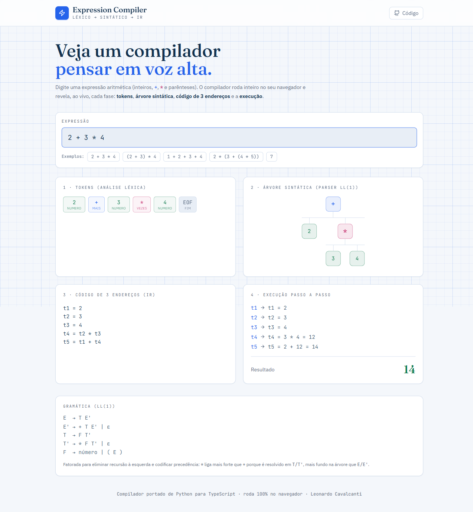

# Arithmetic Expression Compiler (Python)

A compiler pipeline for arithmetic expressions implemented entirely in Python with no external dependencies. The system performs lexical analysis, LL(1) recursive-descent parsing, 3-address intermediate code (IR) generation, and IR execution — exposed through an interactive REPL.

### 🧪 Playground interativo (ao vivo)

[](https://leonardopcavalcanti.github.io/python-expression-compiler/)

**[leonardopcavalcanti.github.io/python-expression-compiler](https://leonardopcavalcanti.github.io/python-expression-compiler/)** — ferramenta web educacional que mostra, ao vivo, cada fase da compilação: **tokens → árvore sintática (AST) → código de 3 endereços → execução passo a passo**, além de mensagens de erro com indicador de posição.

> O playground (em [`playground/`](playground/)) é um port fiel do compilador para TypeScript (React + Vite), rodando 100% no navegador. Útil como apoio didático para a disciplina de Compiladores.

---

## O que este projeto ensina

> Um compilador é uma das ideias mais elegantes da Ciência da Computação: transformar texto em significado executável, fase por fase. Este projeto isola o **front-end** de um compilador para que cada etapa fique visível.

### 1. As três fases do front-end
```
texto  →  [Análise Léxica]  →  tokens  →  [Análise Sintática]  →  AST  →  [Geração de IR]  →  código intermediário
```
- **Análise léxica (lexer):** quebra a sequência de caracteres em *tokens* (`NUMBER`, `PLUS`, `STAR`, `LPAREN`...). É reconhecimento de **linguagens regulares** — por isso o lexer usa expressões regulares.
- **Análise sintática (parser):** verifica se a sequência de tokens obedece à **gramática** e constrói a estrutura. Aqui saímos das linguagens regulares para as **linguagens livres de contexto** (uma regular não conta parênteses balanceados; uma livre de contexto, sim).
- **Geração de código intermediário (IR):** traduz a estrutura para instruções simples e independentes de máquina.

### 2. Por que a gramática é fatorada para LL(1)
A gramática deste projeto não é "natural" por acaso:
```
E  → T E'      E' → + T E' | ε
T  → F T'      T' → * F T' | ε
F  → number | ( E )
```
- **Eliminação de recursão à esquerda:** uma regra como `E → E + T` faria um parser descendente recursivo entrar em **loop infinito**. A reescrita com `E'` remove isso.
- **LL(1) = decisão com 1 token de *lookahead*:** o parser escolhe qual regra aplicar olhando **apenas o próximo token**, sem retroceder (*backtracking*). É o que torna o *recursive descent* simples e linear.
- **Precedência embutida na estrutura:** `*` fica "mais fundo" na gramática (`T`) que `+` (`E`), então `2 + 3 * 4` agrupa a multiplicação primeiro — sem nenhum pós-processamento.

### 3. Código de três endereços (3-address code)
A IR usa **temporários nomeados** (`t1`, `t2`, ...), cada instrução com no máximo um operador:
```
t4 = t2 * t3
t5 = t1 + t4
```
É a forma intermediária clássica entre a árvore e o código de máquina — fácil de otimizar e de mapear para registradores. É também a fronteira onde a **avaliação** acontece (a expressão vira uma lista de passos executáveis).

### 4. Erros como cidadãos de primeira classe
Lexer e parser distinguem **erro léxico** (um caractere que não forma token) de **erro sintático** (tokens válidos em ordem inválida), reportando a **posição** — a base de boas mensagens de compilador.

**Leituras de referência:**
- Aho, Lam, Sethi & Ullman — *Compilers: Principles, Techniques, and Tools* (o "livro do dragão"), caps. 3 (análise léxica) e 4 (análise sintática).
- Robert Nystrom — [*Crafting Interpreters*](https://craftinginterpreters.com/) (gratuito online), excelente introdução prática a lexers e parsers.

---

## Tech Stack

| Component | Technology |
|-----------|-----------|
| Language | Python 3 (stdlib only) |
| Lexer | Regular expressions (`re` module) |
| Parser | LL(1) recursive descent |
| IR | 3-address code with named temporaries |
| Interface | Interactive REPL (stdin/stdout) |
| Tests | `unittest` (standard library) |

---

## Supported Language

| Feature | Details |
|---------|---------|
| Literals | Non-negative integers (`0`, `42`, `999`) |
| Operators | Addition (`+`), Multiplication (`*`) |
| Grouping | Parentheses `( )` |
| Precedence | `*` binds tighter than `+` |

---

## Grammar (LL(1))

The grammar is factored to eliminate left recursion and encode operator precedence:

```
E  → T E'
E' → + T E' | ε
T  → F T'
T' → * F T' | ε
F  → number | ( E )
```

`E` handles addition, `T` handles multiplication, and `F` handles atoms (literals and parenthesized sub-expressions). This structure guarantees correct precedence without any post-processing.

---

## Compilation Pipeline

```
Input string
    │
    ▼
[Lexer]  analisador_lexico.py
    │  Tokenizes input into: NUMBER, PLUS, STAR, LPAREN, RPAREN, EOF
    │
    ▼
[Parser] analisador_sintatico.py
    │  LL(1) recursive descent; drives IR generation during parsing
    │
    ▼
[IR Generator] codigo_intermediario.py
    │  Emits 3-address instructions: tN = operand op operand
    │
    ▼
[IR Executor]
    │  Evaluates the instruction list; returns the value of the last temporary
    │
    ▼
Result
```

### Example — `2 + 3 * 4`

Generated IR:

```
t1 = 2
t2 = 3
t3 = 4
t4 = t2 * t3
t5 = t1 + t4
```

Result: `t5 = 14`

---

## Project Structure

```
python-expression-compiler/
├── main.py                          # Entry point, launches the REPL
├── requirements.txt                 # Empty (no external dependencies)
├── src/tradutor_expressoes/
│   ├── tokens.py                    # Token type definitions
│   ├── analisador_lexico.py         # Lexer (tokenizer)
│   ├── analisador_sintatico.py      # Parser (LL(1) recursive descent)
│   ├── codigo_intermediario.py      # 3-address IR generator and executor
│   ├── interface_repl.py            # REPL loop
│   ├── erros.py                     # Error types (LexicalError, SyntaxError)
│   └── utils.py                     # Shared utilities
└── tests/
    ├── teste_analisador_lexico.py
    ├── teste_avaliacao_expressao.py
    ├── teste_erros_sintaticos.py
    └── teste_interface_repl.py
```

---

## Running

### Standard mode

```bash
python main.py
```

The REPL reads one expression per line, prints the result, and loops. On error, prints a diagnostic and continues.

```
> 2 + 3 * 4
Expressão válida. Resultado: 14

> (1 + 2) * (3 + 4)
Expressão válida. Resultado: 21

> 2 +
Erro sintático: token inesperado após '+'
```

### Debug mode

Prints the token stream and full IR listing before the result:

```bash
python main.py --debug
```

---

## Running Tests

```bash
# Run all tests
python -m pytest tests/

# Run a single test file
python -m pytest tests/teste_analisador_lexico.py

# Run with verbose output
python -m pytest tests/ -v
```

No installation required — all dependencies are part of the Python standard library.
